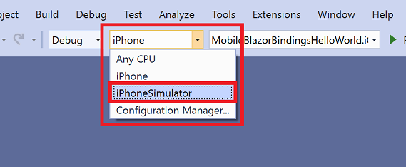

# Troubleshooting Maui Blazor Bindings

[!INCLUDE [experiment-warning](../includes/experiment-warning.md)]

## Trying to run on iOS, getting "no iOS code signing key" error

If you choose to run the iOS project, you might get an error indicating that there are no iOS code signing keys. That could mean you are trying to deploy to a physical iOS device (such as an iPhone) but without the right configuration. If you intend to use the iOS Simulator, iPhoneSimulator target platform is selected.

[  ](./media/troubleshooting/ios-target-platform-expanded.png#lightbox)

## Hybrid app doesn't show HTML web UI content

HTML web UI content not showing up could be caused by several reasons. Check each of these in your app:

1. Check for a browser version mismatch. The web UI is shown in a browser component that is hosted inside the native app. The browser component can be dependent on the installed web browsers on the device.

   For WPF (Windows), check that you have [Microsoft Edge Canary Channel](https://www.microsoftedgeinsider.com/download). This version of Microsoft Edge installs side-by-side with other Microsoft Edge installations.

1. Check for script errors in the browser component. Check the [debug hybrid apps](debug-hybrid-apps.md) topic to learn how to check for browser script errors.

1. Check that the platform-specific project calls the appropriate `WebView` `BlazorHybrid` `Init` method (some variations may be expected):

   * Android: In the `MainActivity.cs` file `OnCreate` method call `BlazorHybridAndroid.Init()`:

      ```csharp
        protected override void OnCreate(Bundle savedInstanceState)
        {
            BlazorBindings.Maui.WebView.Android.BlazorHybridAndroid.Init();
        ...
          ```

   * iOS: In the `Main.cs` file `Main` method call `BlazorHybridIOS.Init()`:

      ```csharp
        static void Main(string[] args)
        {
            BlazorBindings.Maui.WebView.iOS.BlazorHybridIOS.Init();
            ...
      ```

   * Windows: In the `App.cs` file `MainWindow` constructor call `BlazorHybridWindows.Init()`:

      ```csharp
        public MainWindow()
        {
            BlazorBindings.Maui.WebView.Windows.BlazorHybridWindows.Init();
            ...
      ```

   * macOS: In the `Main.cs` file `Main` method call `BlazorHybridMacOS.Init()`:

      ```csharp
        private static void Main(string[] args)
        {
            BlazorBindings.Maui.WebView.macOS.BlazorHybridMacOS.Init();
            ...
      ```

## Hybrid app not loading static assets such as CSS and images

If your hybrid app is displaying the HTML rendered content but without the CSS and images, it could mean that the static assets are not being found.

These are some possible causes and fixes:

* Ensure that the correct path is being used. Static assets are referenced using the Blazor static file path pattern, which is `_content/<PROJECT_NAME>/path/to/the/file.css`. For example, in a project named `MySampleProject` a CSS file located in `wwwroot/css/bootstrap/bootstrap.min.css` would be referenced as `_content/MySampleProject/css/bootstrap/bootstrap.min.css`.

* For Android, iOS, and macOS, make sure that the platform-specific project has a _direct_ reference to the project or package that contains the static assets. The type of CSPROJ file that they use requires that the reference be direct (project-to-project) instead of merely transitive (that is, project-to-project-to-project). (Windows projects do not require this.)

## CSS styles not working

Refer to the [CSS troubleshooting section](../ui/css-styles.md#troubleshooting).

## Where to go for more solutions

If you're still stuck or have a question, reach out on the [GitHub repo](https://github.com/Dreamescaper/BlazorBindings.Maui) by logging an issue.
