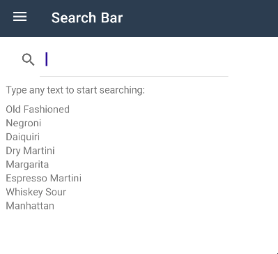
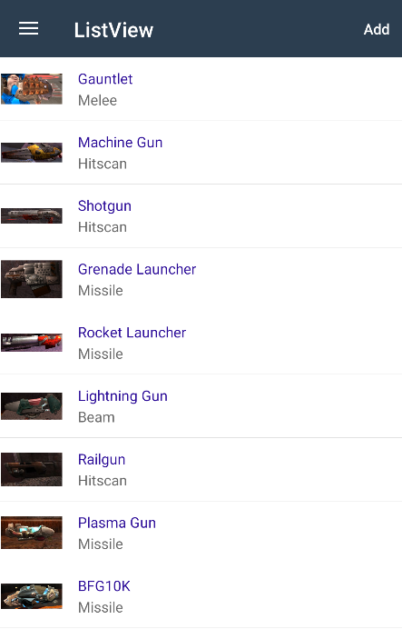

# BlazorBindings.Maui - Preview 11

Another BlazorBindings.Maui update.

## New controls supported

### SearchBar

```xml
<SearchBar @bind-Text="_searchQuery" @bind-Text:after="UpdateSearchResults" />
<CollectionView ItemsSource="_displayedItems" />

@code {
    string _searchQuery;
    string[] _displayedItems;

    async Task UpdateSearchResults()
    {
        _displayedItems = await /* retrieve items */;
    }
}
```


### IndicatorView

```xml
<CarouselView IndicatorView="() => indicatorView">
    <ItemTemplate>
        ...
    </ItemTemplate>
</CarouselView>

<IndicatorView @ref="indicatorView"
               HorizontalOptions="LayoutOptions.Center"
               IndicatorColor="Colors.DarkGray"
               SelectedIndicatorColor="Colors.LightGray" />

@code {
    IndicatorView indicatorView;
}

```


### SwipeView

```xml
@foreach (var item in _items)
{
    <SwipeView>
        <RightItems>
            <SwipeItems>
                <SwipeItem BackgroundColor="Colors.Yellow"
                       Text="Favorite"
                       OnInvoked="() => MakeFavorite(item)" />

                <SwipeItem BackgroundColor="Colors.Red"
                       Text="Remove"
                       IsDestructive="true"
                       OnInvoked="() => Remove(item)" />
            </SwipeItems>
        </RightItems>

        <ChildContent>
            <ContentView BackgroundColor="Colors.Green" Padding="8">
                <Label>@item</Label>
            </ContentView>
        </ChildContent>
    </SwipeView>
}
```


### TableView

```xml
    <TableView>
        <TableRoot>
            <TableSection Title="Cells examples">
                <TextCell Text="Click me" Detail="Tapping makes something happen." OnTapped="OnCellTapped" />
                <EntryCell Label="Enter your name:" @bind-Text="entryText" />
                <SwitchCell Text="Click to toggle:" @bind-On="switchOn" />
            </TableSection>
        </TableRoot>
    </TableView>
```


### ListView

```xml
<ListView ItemsSource="items" SelectionMode="ListViewSelectionMode.None">
    <ItemTemplate>
        <ImageCell Text="@context.Name" Detail="@context.Type" ImageSource="@context.ImageUrl">
            <ContextActions>
                <MenuItem Text="Remove" IsDestructive="true" OnClick="() => RemoveItem(context)" />
            </ContextActions>
        </ImageCell>
    </ItemTemplate>
</ListView>
```



## Behaviors

```xml
<ContentPage Title="CommunityToolkit.Behaviors">
    <Behaviors>
        <StatusBarBehavior StatusBarColor="Colors.Green" />
    </Behaviors>

    ...
</ContentPage>
```


## BlazorBindingsApplication

Previously, you had to use `MauiBlazorBindingsRenderer` instance to add BlazorBindings component to your application. However, `MauiBlazorBindingsRenderer` is not recommended to be used from the application code, as it is a low level implementation detail.
This release brings an easy to use `BlazorBindingsApplication` type, which accept your root component type as a generic argument.

You can either inherit your App type from BlazorBindingsApplication, if you need to customize the Application in any way:
```csharp    
public class App : BlazorBindingsApplication<AppShell>
    {
        public App(IServiceProvider services) : base(services)
        {
            // Do whatever you need (e.g. add resources).
        }
    }
```

Or you can use this type directly in simple cases:
```csharp
builder.UseMauiApp<BlazorBindingsApplication<AppShell>>();
``` 

## Root Wrapper

Generally, BlazorBindings' renderer creates separate render trees for each page - that includes MainPage and navigations (both regular and modals). However, in some cases it might be useful to have a _wrapping_ component - e.g. to define global cascading parameters, or to update all the pages on some theme changed.

Now it is possible to do that via `BlazorBindingsApplication`'s `WrapperComponentType` property. 

For instance, here's an example of a wrapping component `Root.razor`, which adds a global cascading value, and updates the UI based on some event: 
```xml
@inject AppState AppState

<CascadingValue Value="123" Name="test">
    @ChildContent
</CascadingValue>

@code {
    [Parameter] public RenderFragment ChildContent { get; set; }

    protected override void OnInitialized() 
    {
        AppState.ThemeChanged += InvokeAsync(() => StateHasChanged());
    }
}
```

Now, it is set as a wrapper component by overriding `WrapperComponentType` property:
```csharp
public class App : BlazorBindingsApplication<AppShell>
{
    public App(IServiceProvider services) : base(services) { }

    public override Type WrapperComponentType => typeof(Root);
}
```

## Error Boundaries

One of use cases for wrapper components is to allow to set a global [error boundary](https://learn.microsoft.com/en-us/aspnet/core/blazor/fundamentals/handle-errors?view=aspnetcore-7.0#error-boundaries). It allows to handle any exception, display a nice error page, and return back to the application (instead of simply crashing the application).

> [!NOTE]
> Error boundaries do not allow to _ignore_ exceptions based on some conditions, and leaving the user on a current page. Error boundary content _is always_ replaced with an error content if any exception occurs.

Here's an example of such wrapper component:
```xml
<ErrorBoundary @ref="_errorBoundary">
    <ChildContent>
        @ChildContent
    </ChildContent>

    <ErrorContent>
        <ContentPage Title="Error">
            <VerticalStackLayout Margin="8" Spacing="8">
                <Label Text="Oops!" HorizontalOptions="LayoutOptions.Center" FontSize="20" />
                <Label Text="Unexpected error has occured:" />
                <Label>@context.Message</Label>

                <Button Text="Return" OnClick="Recover" />
            </VerticalStackLayout>
        </ContentPage>
    </ErrorContent>

</ErrorBoundary>

@code {
    [Parameter] public RenderFragment ChildContent { get; set; }

    ErrorBoundary _errorBoundary;

    void Recover() {
        _errorBoundary.Recover();
    }
}
```


> [!NOTE]
> You'll need to create your ErrorBoundary type, implementing ErrorBoundaryBase. You can take a look [here](https://github.com/Dreamescaper/BlazorBindings.Maui/blob/main/samples/ControlGallery/Views/ErrorBoundaries/ErrorBoundary.cs) for an example.


## Entry is generic

## Other changes
- Component Generator adds XML documentation now.

## Breaking changes

- `NativeControlComponentBase.ElementHandler` is protected now.
- Control components do not inherit `ComponentBase` anymore.
- Default error page is removed. Application will crash in case of unhandled exceptions now.
- 