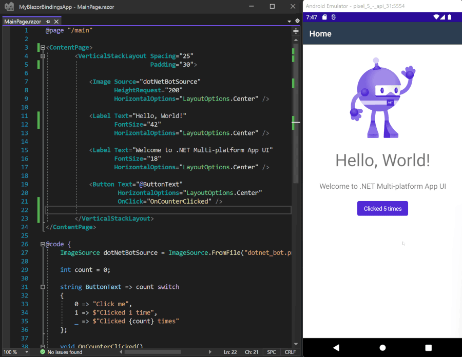
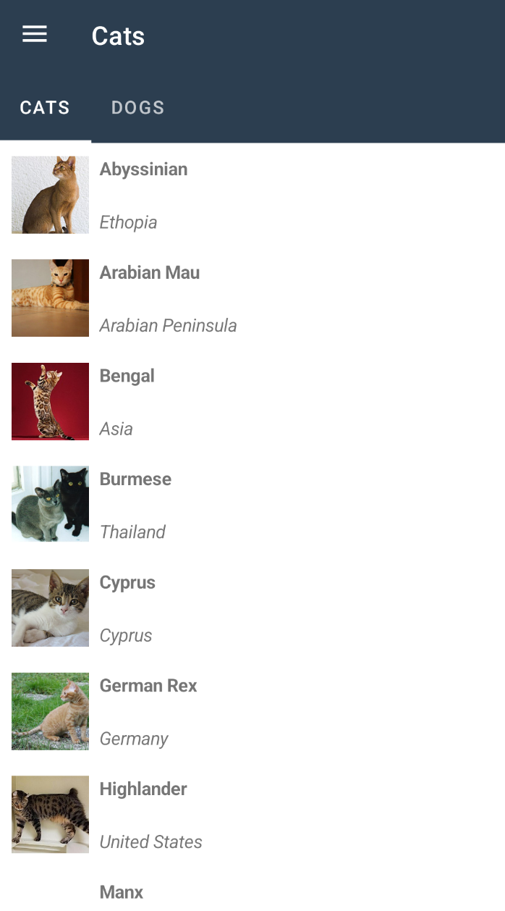

# BlazorBindings.Maiu - Preview 6

## About this project

This project is a fork of [MobileBlazorBindings](https://github.com/dotnet/MobileBlazorBindings) - experimental project by Microsoft to allow to use Blazor syntax for native controls instead of XAML. That repository hasn't received much of an attention recently, so I decided to fork it and maintain separately. If at any point of time Microsoft developers decide to push that repository moving forward, I'll gladly contribute all of my changes to the original repository. 

## Get started

To get started building a MAUI app using Blazor syntax run the following command:

```
dotnet new -i BlazorBindings.Maui.Templates::0.6.163-preview
```

And then create first project by running command:
```
dotnet new blazorbindingsmaui -o MyBlazorBindingsApp
```

## MAUI update

First of all, the project is updated to support MAUI instead of MAUI. `VerticalStackLayout` and `HorizontalStackLayout` controls, which were added in MAUI, are supported as well. With MAUI update, Hot Reload is supported.



## CollectionView

Bindings for CollectionView control are added in this release. The easiest way to use it is to provide ItemsSource property and to define ItemTemplate.

`CatsPage.razor`
```xml
<ContentPage>
    <CollectionView ItemsSource="CatData.Cats">
        <ItemTemplate>
            <AnimalTemplate Animal="context" OnClick="AnimalClicked" />
        </ItemTemplate>
    </CollectionView>
</ContentPage>
```

`AnimalTemplate.razor`
```xml
<Grid Padding="10" ColumnSpacing="8" RowDefinitions="Auto, Auto" ColumnDefinitions="Auto, *">
    <TapGestureRecognizer OnTapped="Details" />

    <GridCell RowSpan="2">
        <Image Source="imageSource"
               Aspect="Aspect.AspectFill"
               HeightRequest="60"
               WidthRequest="60" />
    </GridCell>

    <GridCell Column="1">
        <Label Text="@Animal.Name"
               FontAttributes="FontAttributes.Bold" />
    </GridCell>

    <GridCell Row="1" Column="1">
        <Label Text="@Animal.Location"
               FontAttributes="FontAttributes.Italic"
               VerticalOptions="LayoutOptions.End" />
    </GridCell>
</Grid>
```


## Support Shell attached properties

You can set Shell properties for the page using ShellProperties element:
```xml
<ContentPage>
    <ShellProperties NavBarIsVisible="false" />

    <ScrollView>
    ...
```
Keep in mind that this approach could still be revisited (e.g. [here](https://github.com/Dreamescaper/BlazorBindings.Maui/issues/5)).


## Other updates

- Editor control support
- Add support for Brushes and Background property
- Add Page.ToolbarItems property
- Lots of bug fixes

## What next?

In next release it is planned to close the gap further between supported MAUI controls, FlexLayout and AbsoluteLayout specifically. ComponentGenerator improvements are planned as well, to help to create bindings for third party MAUI controls.
If you have any suggestions or ideas, feel free to log [issues](https://github.com/Dreamescaper/BlazorBindings.Maui/issues)!