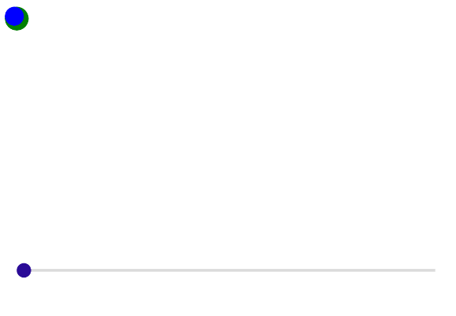
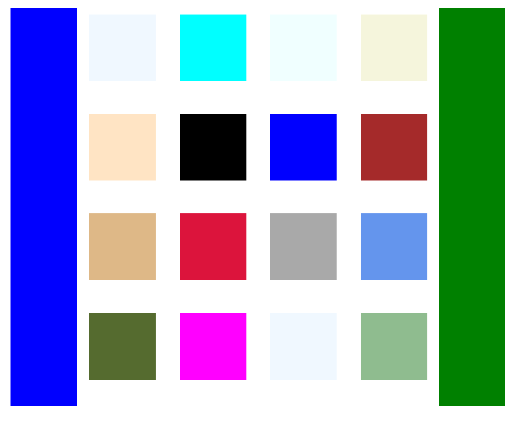

# BlazorBindings.Maui - Preview 7

Following the MAUI Global Availability release, BlazorBindings.Maui is updated as well, adding a bunch of features and improvements. Take a look at [Get Started](../get-started.md) page to check it out!

## Shell navigation with object parameters

ShellNavigationManager is updated to support passing object parameters during the navigation.
```xml
@page "/beardetails"

<ContentPage>
...
</ContentPage>

@code {
    [Parameter] public Animal Bear { get;set; }
}
```

```xml
<Button Text="Go to Bear details" OnClick="GoToBearDetails" />

@code {
    [Inject] ShellNavigationManager Navigation {get; set; }

    Animal bearDetails;

    ...

    async Task GoToBearDetails()
    {
        await Navigation.GoToAsync("/beardetails", new Dictionary<string, object>
        {
            ["Bear"] = bearDetails;
        });
    }
}
```

## Attached properties support
There is no built-in support for the attached properties in Blazor so far, which makes it a bit hard with MAUI, where attached properties are used heavily. In the previous versions they were supported using either parent (e.g. `GridCell`) or child (e.g. `ShellProperties`) elements, but in some cases such approach leads to a very verbose markup. In this update support for the attached properties is added via Blazor parameter with `CaptureUnmatchedValues = true`. Properties for the following types are supported - Grid, Shell, FlexLayout, AbsoluteLayout.
```xml
<ContentPage Title="Shell Properties"
             Shell.NavBarIsVisible="true"
             Shell.TabBarIsVisible="false"
             Shell.TitleColor="@Colors.Green">
...
</ContentPage>
```
> [!NOTE]
> This approach is not perfect. Such properties have no IntelliSense support or compile time validation, they are basically `<string, object>` pairs. Therefore, this approach might be revised in future.

## Absolute Layout
With the attached properties support, is became possible to add two layouts previously missing. First one is AbsoluteLayout, which is used to position and size children using explicit values.
```xml
<AbsoluteLayout HeightRequest="200">
    <BoxView Color="Colors.Green"
             CornerRadius="10"
             AbsoluteLayout.LayoutBounds=@(new Rect(_greenX, _greenY, 20, 20))
             AbsoluteLayout.LayoutFlags="@AbsoluteLayoutFlags.PositionProportional" />

    <BoxView Color="Colors.Blue"
             CornerRadius="8"
             AbsoluteLayout.LayoutBounds=@(new Rect(_blueX, _blueY, 16, 16))
             AbsoluteLayout.LayoutFlags="@AbsoluteLayoutFlags.PositionProportional" />
</AbsoluteLayout>

<Slider Minimum="0" Maximum="1" ValueChanged="SliderValueChanged" />

@code {
    double _greenX;
    double _greenY;
    double _blueX;
    double _blueY;

    void SliderValueChanged(double value)
    {
        _blueX = value;
        _greenX = value;

        _greenY = (-Math.Cos(_blueX * 10) + 1) / 2;
        _blueY = (-Math.Cos(_blueX * 20) + 1) / 2;
    }
}
```


## Flex Layout
FlexLayout is another layout control which is supported with BlazorBindings.Maui now.

```xml
<FlexLayout HeightRequest="300">
    <FlexLayout Wrap="FlexWrap.Wrap" FlexLayout.Grow="1">
        @foreach (var color in _colors)
        {
            <BoxView Color="color" HeightRequest="50" WidthRequest="50" Margin="5" />
        }
    </FlexLayout>

    <BoxView FlexLayout.Basis="50"
             FlexLayout.Order="-1"
             Color="Colors.Blue" />

    <BoxView FlexLayout.Basis="50"
             Color="Colors.Green" />
</FlexLayout>

@code {
    Color[] _colors = new[] {
        Colors.AliceBlue,
        Colors.Aqua,
        Colors.Azure,
        Colors.Beige,
        Colors.Bisque,
        Colors.Black,
        Colors.Blue,
        Colors.Brown,
        Colors.BurlyWood,
        Colors.Crimson,
        Colors.DarkGray,
        Colors.CornflowerBlue,
        Colors.DarkOliveGreen,
        Colors.Fuchsia,
        Colors.AliceBlue,
        Colors.DarkSeaGreen
    };
}
```


## What next?

In the next release it is planned to add support for the CarouselView and RefreshView controls. ComponentGenerator improvements are planned as well, to help to create bindings for third party MAUI controls.
If you have any suggestions or ideas, you are welcome log [issues](https://github.com/Dreamescaper/BlazorBindings.Maui/issues)!