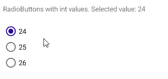
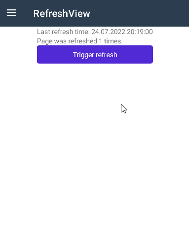
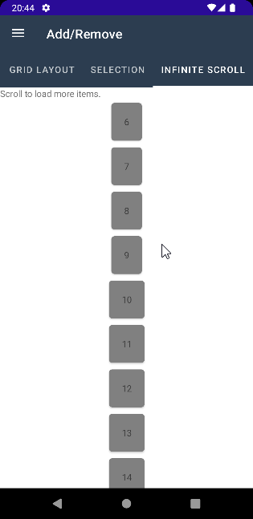
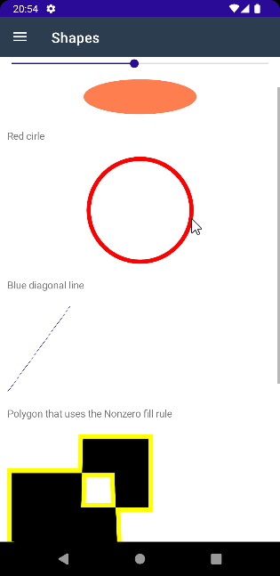

# BlazorBindings.Maui - Preview 8

Another BlazorBindings.Maui update, which includes the support for multiple MAUI controls and some improvements. Take a look at [Get Started](../get-started.md) page to check it out!

## RadioButtons

`RadioButton` control is supported now. You can wrap them in `RadioButtonGroup` component to be able to bind selected value easily.
```xml
<RadioButtonGroup @bind-SelectedValue="selectedIntValue">
    <RadioButton Value="24" />
    <RadioButton Value="25" />
    <RadioButton Value="26" />
</RadioButtonGroup>


@code {
    int? selectedIntValue;
}
```


## CarouselView

Another collection control is supported now, which allows to present data in a scrollable layout.
```xml
<CarouselView ItemsSource="items"
              Loop="false"
              @bind-CurrentItem="currentItem"
              @bind-Position="currentPosition">

    <ItemTemplate>
        <Frame BackgroundColor="Colors.LightPink"
               CornerRadius="10"
               HeightRequest="300"
               WidthRequest="300">

            <VerticalStackLayout>
                <Label HorizontalOptions="LayoutOptions.Center">@context.Name</Label>
                <Image Source="context.Image" />
            </VerticalStackLayout>
        </Frame>
    </ItemTemplate>
</CarouselView>
```

## RefreshView
`RefreshView` is a container control that provides pull to refresh functionality for scrollable content. You can provide `OnRefreshing` callback parameter value to perform your refresh actions. Refresh indication will be hidden automatically after refresh action is executed.
```xml
    <RefreshView OnRefreshing="Refresh">
        <ScrollView>
            <VerticalStackLayout>
                <Label>Last refresh time: @_refreshTime</Label>
                <Label>Page was refreshed @_refreshCount times.</Label>
            </VerticalStackLayout>
        </ScrollView>
    </RefreshView>

@code {
    DateTime _refreshTime;
    int _refreshCount = 0;

    public async Task Refresh()
    {
        await Task.Delay(2000);
        _refreshTime = DateTime.Now;
        _refreshCount++;
    }
}
```


You can also take a look at the [following sample page](https://github.com/Dreamescaper/BlazorBindings.Maui/blob/main/samples/ControlGallery/Views/Collections/CollectionView/InfiniteScrollPage.razor), which uses RefreshView with a CollectionView. 




## Shapes
Preview 8 adds the support for the following shape controls:
- Ellipse
- Line
- Polygon
- Polyline
- Rectangle

```xml
<Ellipse FillColor="Colors.Coral"
         WidthRequest="EllipseWidth"
         HeightRequest="50" />

<Ellipse StrokeColor="Colors.Red"
         StrokeThickness="CircleThickness"
         WidthRequest="150"
         HeightRequest="150" />

<Line X1="LineX1"
      Y1="0"
      X2="0"
      Y2="120"
      StrokeColor="Colors.DarkBlue"
      StrokeDashArray="1,1"
      StrokeDashOffset="6" />

<Polygon Points="0,48 0,144 96,150 100,0 192,0 192,96 50,96 48,192 150,200 144,48"
         FillColor="Colors.Black"
         FillRule="FillRule.Nonzero"
         StrokeColor="Colors.Yellow"
         StrokeThickness="PolygonThickness" />

@code {
    double _value = 10;

    double PolygonThickness => 3 + _value;
    double LineX1 => 40 + 5 * _value;
    double CircleThickness => 4 + _value / 5;
    double EllipseWidth => 150 + _value;
}
```



## Breaking changes

### FlyoutPage updates

While using the `Shell` app is the recommended approach, some people still prefer to use `FlyoutPage` as your MainPage. `Flyout` and `Detail` properties require `Page` child now, matching how it is used in MAUI itself. You can take a look at the [following sample](https://github.com/Dreamescaper/BlazorBindings.Maui/tree/main/samples/FlyoutPageSample/Views) for details.

### Picker.ItemDisplayBinding

`Picker` `ItemDisplayBinding` property type is changed from `string` to `Func<T, string>`.
```xml
<Picker ItemsSource="Models"
        Title="Select a model"
        ItemDisplayBinding="i => i.Name"
        @bind-SelectedItem="SelectedModel" />
```

## Samples

- [ControlGallery sample](https://github.com/Dreamescaper/BlazorBindings.Maui/tree/main/samples/ControlGallery) is reworked to have a cleaner structure. If you need the examples of how to use BlazorBindings.Maui elements, including the once added in the latest update, check it out!
- [FlyoutPage sample](https://github.com/Dreamescaper/BlazorBindings.Maui/tree/main/samples/FlyoutPageSample) is added to demostrate how to use FlyoutPage (instead of the regular Shell application).
- [Fluxor sample](https://github.com/Dreamescaper/BlazorBindings.Maui/tree/main/samples/FluxorSample) shows how to use BlazorBindings.Maui with [Fluxor](https://github.com/mrpmorris/Fluxor) - popular state management tool.

## Other

- Performance improvements, mostly around `CollectionView`.
- Add the support for `Shell` `ItemTemplate` and `MenuItemTemplate` properties.


## What next?

In the next update ComponentGenerator improvements are planned to help to create bindings for third party MAUI controls. Performance improvements are planned as well.
If you have any suggestions or ideas, you are welcome log [issues](https://github.com/Dreamescaper/BlazorBindings.Maui/issues)!