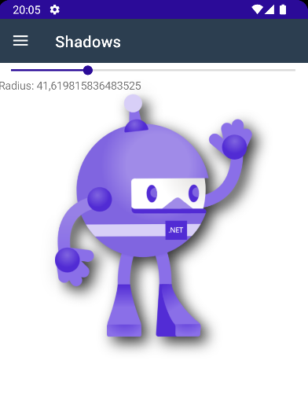
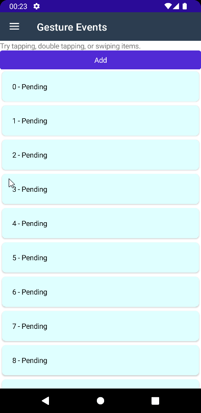

# BlazorBindings.Maui - Preview 9

Another BlazorBindings.Maui update, which adds component generator, shadows, and other improvements. Take a look at [Get Started](../get-started.md) page to check it out!

## Component Generator

This release adds the ability to generate Blazor components for third party controls. Originally it was planned to implement it as a [source generator](https://docs.microsoft.com/en-us/dotnet/csharp/roslyn-sdk/source-generators-overview), but, unfortunately, source generators don't play well with razor files. Therefore, generator is packed as a dotnet tool. In order to generate Blazor component for a control, you need to add assembly attribute with control info, e.g.

```csharp
[assembly: GenerateComponent(typeof(CommunityToolkit.Maui.Views.AvatarView))]
```

Then, you need to install and run generator tool in project folder:

```
dotnet tool install --global BlazorBindings.Maui.ComponentGenerator

dotnet generate-maui-blazor-components
```

You take a look at [a sample project](https://github.com/Dreamescaper/BlazorBindings.Maui/blob/main/samples/ThirdPartyControlsSample/Properties/Elements.cs) with generated components for `AlohaKit` and `CommunityToolkit` libraries.

Keep in mind that it still doesn't support some parameter types (like Shapes or Templates).

## Shadows

Shadows are supported with Blazor components now:
```xml
<Image Source=@("dotnet_bot.png")
       WidthRequest="250"
       HeightRequest="310">
    <Shadow>
        <Shadow Color="Colors.Black"
                Offset="new (20, 20)"
                Radius="50"
                Opacity="0.8f" />
    </Shadow>
</Image>
```


## Gesture events

In order to add, for instance, tap event handler for some arbitrary control, you use Maui Gesture Recognizers. And that is already possible with Maui Blazor Bindings as well. However, the syntax is quite verbose, so this release adds events for the most used gestures directly to component (they are still implemented as gesture recognizers underneath):
```xml
<Frame OnTap="OnTap"
       OnDoubleTap="OnDoubleTap"
       OnPanUpdate="OnPanUpdate">

    <Label>@Item - @status</Label>
</Frame>

@code {
    [Parameter] public int Item { get; set; }

    string status = "Pending";

    void OnTap() => status = "Tapped";
    void OnDoubleTap() => status = "Double Tapped";

    async Task OnPanUpdate(PanUpdatedEventArgs args)
    {
        // ...
    }
}
```



## Breaking changes

### Significant internal changes

In Preview 9 element wrappers implementation is changed significantly in order to simplify it and to improve performance. Blazor components API is unchanged, so it won't affect most users. But if you have created any custom bindings (e.g. wrapping a third party control), they will probably not work with Preview 9. Hopefully, that wound't be a huge issue thanks to a component generator.

### TimePicker / DatePicker updates

`TimePicker` is updated to use recently-added `TimeOnly` type instead of `TimeSpan`, as this type is much more suitable to represent time of day. Same, `DatePicker` is updated to use `DateOnly` instead of `DateTime`.

## What next?

- Further ComponentGenerator improvements ([#45](https://github.com/Dreamescaper/BlazorBindings.Maui/issues/45)).
- Navigation service overhaul ([#44](https://github.com/Dreamescaper/BlazorBindings.Maui/issues/44)).

If you have any suggestions or ideas, you are welcome log [issues](https://github.com/Dreamescaper/BlazorBindings.Maui/issues)!